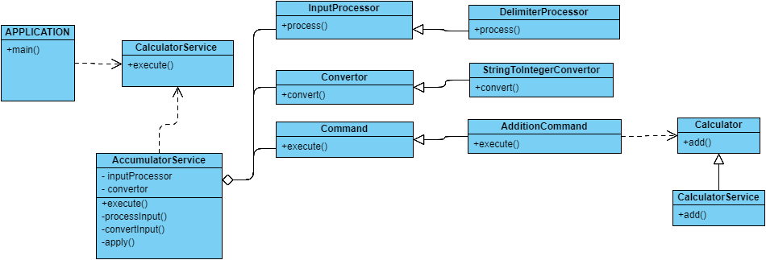

# ACCUMULATOR SERVICE
  ### UML
   A rough diagram
     
   
  ### Prerequisite
   * Maven 3+
   * Java 8
  
  ### Steps to run Application 
  
   * Build the maven application
    
   
    mvn clean install
       
       
   *  Run the application
   
    java -cp target\addition-1.0.0.jar com.ubs.addition.Application
         
         
  ### Sample Output
         
         
         